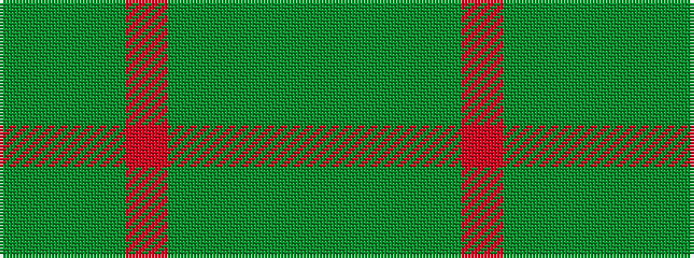

GGGGRGGG

It is a 8 stripe tartan.

<figure class="pat-woven">

<figcaption>idealised sample</figcaption>
</figure>

## Colour Sequence



## Tartans with this colour sequence

| Tartans |
|---------------|
| [Daks (Muted Loden)](/setts/s8/dy3g6dg2r2dg14g2dg2dy3~x2/)|
||
