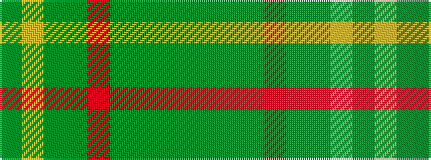

GGGGRGGYG

It is a 9 stripe tartan.

<figure class="pat-woven">

<figcaption>idealised sample</figcaption>
</figure>

## Colour Sequence



## Tartans with this colour sequence

| Tartans |
|---------------|
| [Armagh](/variants/s9/g4ly2g17dg2r4dg2g3dg11g2~x2/)|
||
| [Armagh, County](/variants/s9/dgi4ly2dgi17dg2r4dg2dgi3dg11dgi2~x2/)|
||
