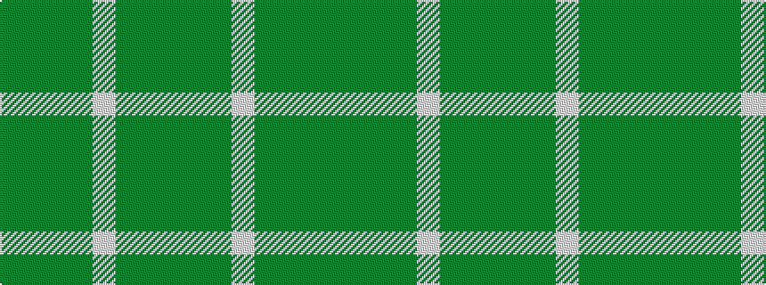

GGGGWGGG

It is a 8 stripe tartan.

<figure class="pat-woven">

<figcaption>idealised sample</figcaption>
</figure>

## Colour Sequence



## Tartans with this colour sequence

| Tartans |
|---------------|
| [Bannockbane Hunting](/variants/s8/dg2dy2dg15dy1w1dg15dy2dg2~x2/)|
||
| [Bannockbane Hunting Trade Tartan](/variants/s8/g2dy2g15dy1w1g15dy2g2~x2/)|
||
