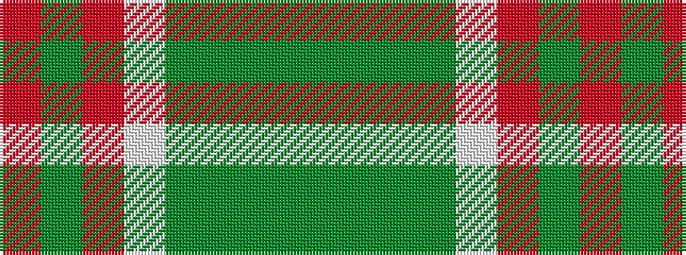

GGGGWRGR

It is a 8 stripe tartan.

<figure class="pat-woven">

<figcaption>idealised sample</figcaption>
</figure>

## Colour Sequence



## Tartans with this colour sequence

| Tartans |
|---------------|
| [Bannock Bane M.406](/setts/s8/dg4dy3dg21dy2w14o22dy3o4~x2/)|
||
