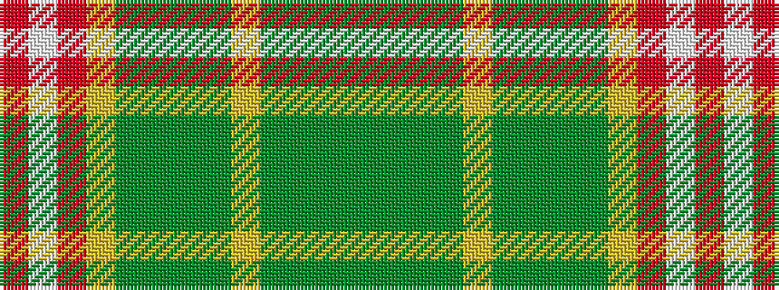

GGGGYGGGGYRWR

It is a 13 stripe tartan.

<figure class="pat-woven">

<figcaption>idealised sample</figcaption>
</figure>

## Colour Sequence



## Tartans with this colour sequence

| Tartans |
|---------------|
| [Pino Family (Pennsylvania) (Personal)](/setts/s13/gi25g7gi25g7lg5gi25g7gi25g7lg5r2w2r2~x2/)|
||
