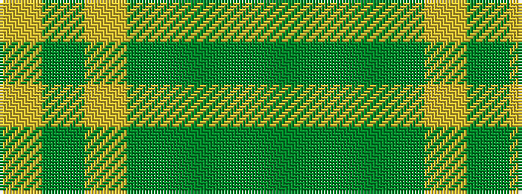

GGGGYGY

It is a 7 stripe tartan.

<figure class="pat-woven">

<figcaption>idealised sample</figcaption>
</figure>

## Colour Sequence



## Tartans with this colour sequence

| Tartans |
|---------------|
| [MacBeorn](/variants/s7/g55dg6g7dg17ly1dg2ly2~x2/)|
||
