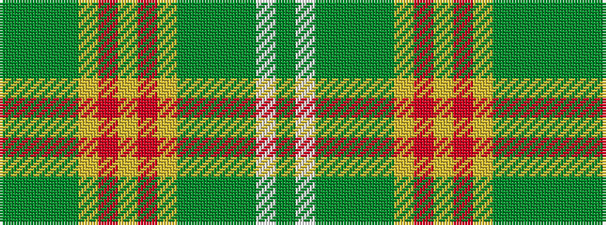

GGGGYRYRYGGGGWG

It is a 15 stripe tartan.

<figure class="pat-woven">

<figcaption>idealised sample</figcaption>
</figure>

## Colour Sequence



## Tartans with this colour sequence

| Tartans |
|---------------|
| [Confessore](/variants/s15/dg12y2dg2y7ly4r2ly8r2ly4y7dg2y2dg16w2dg4~x2/)|
||
| [Confessore Family Tartan](/variants/s15/dg12y2dg2y7ly4o2ly8o2ly4y7dg2y2dg16w2dg4~x2/)|
||
