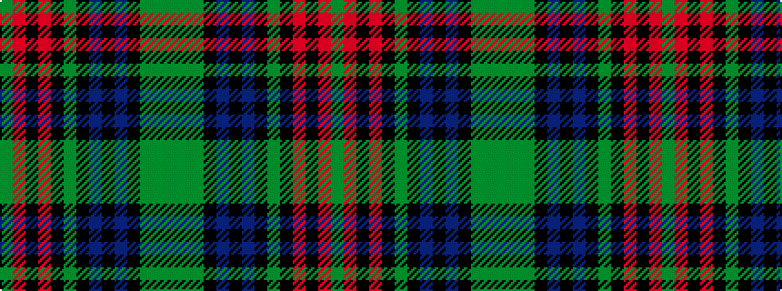

GGGKBKBKGKRKRG

It is a 14 stripe tartan.

<figure class="pat-woven">

<figcaption>idealised sample</figcaption>
</figure>

## Colour Sequence



## Tartans with this colour sequence

| Tartans |
|---------------|
| [King, Garry (Personal)](/setts/s14/gi2r11k3r4k7gi2k3dp4k3dp11k3dg1g1gi1~x2/)|
||
