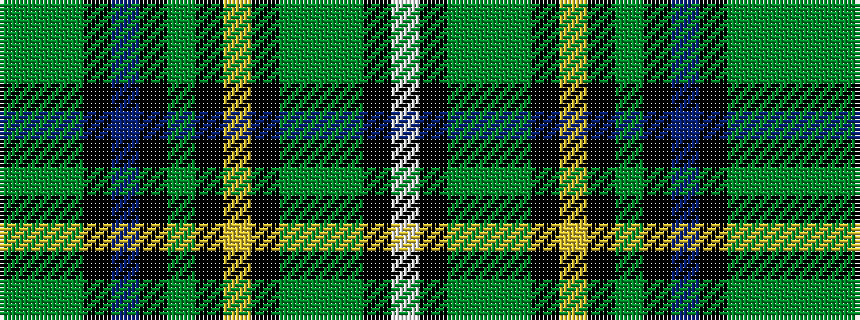

GGGKBKGKYKGGGKW

It is a 15 stripe tartan.

<figure class="pat-woven">

<figcaption>idealised sample</figcaption>
</figure>

## Colour Sequence



## Tartans with this colour sequence

| Tartans |
|---------------|
| [Eastern Shore Police Emerald Society](/setts/s15/g4dg40g4k8n4k8g5k2ly4k2dg1g2dg2k1w1~x2/)|
||
