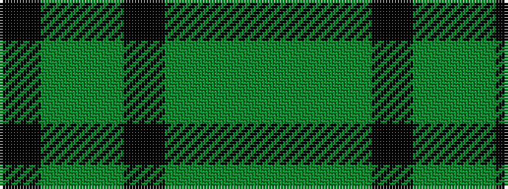

GGGKGGK

It is a 7 stripe tartan.

<figure class="pat-woven">

<figcaption>idealised sample</figcaption>
</figure>

## Colour Sequence



## Tartans with this colour sequence

| Tartans |
|---------------|
| [Joe Strummer Commemorative](/variants/s7/k3dy3yi6k12y1dyi2dy2~x4/)|
||
