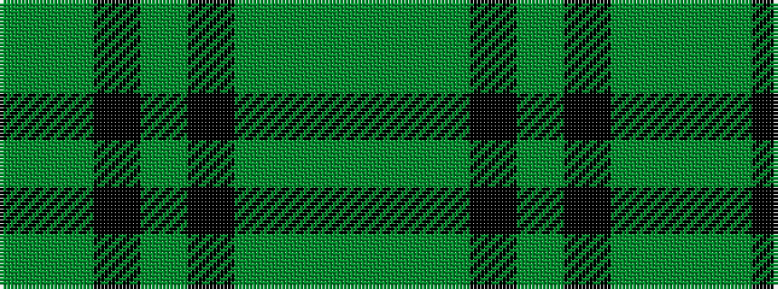

GGGKGKGG

It is a 8 stripe tartan.

<figure class="pat-woven">

<figcaption>idealised sample</figcaption>
</figure>

## Colour Sequence



## Tartans with this colour sequence

| Tartans |
|---------------|
| [Huntsman](/variants/s8/y3dyi3y4k4dy14k3y41g2~x2/)|
||
