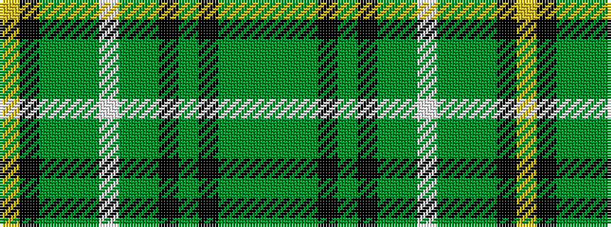

GGGKGKGGWGGGKY

It is a 14 stripe tartan.

<figure class="pat-woven">

<figcaption>idealised sample</figcaption>
</figure>

## Colour Sequence



## Tartans with this colour sequence

| Tartans |
|---------------|
| [Celtic Football Club (1996)](/variants/s14/dg5g3dg16k2dg4k12g4dg2lb5dg2g16dg2k2ly3~x2/)|
||
