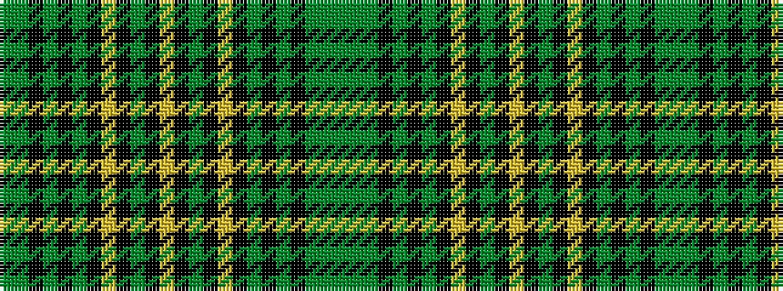

GGGKGKGKYKGKYKGKYKGKGKGG

It is a 24 stripe tartan.

<figure class="pat-woven">

<figcaption>idealised sample</figcaption>
</figure>

## Colour Sequence



## Tartans with this colour sequence

| Tartans |
|---------------|
| [Celtic 2005 Sports Tartan Tartan Number: 6496. Earliest known date: 2005 January Designed by Claire Donaldson of The House of Edgar for Celtic Football Club updating the club's tartan for 2005. See products available Copyright © Blair Urquhart, Comrie, 2015](/setts/s24/dg6dgi3dg22k2dg4k14dgi5k3ly5k3dgi20k4lo4~x2/)|
||
