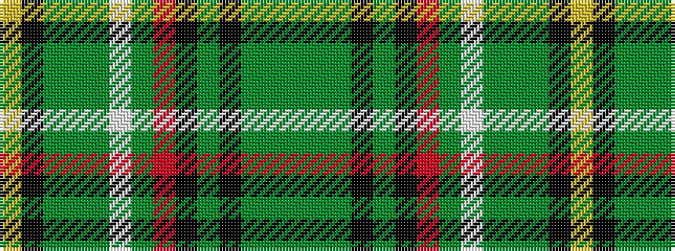

GGGKGKRGWGGGKY

It is a 14 stripe tartan.

<figure class="pat-woven">

<figcaption>idealised sample</figcaption>
</figure>

## Colour Sequence



## Tartans with this colour sequence

| Tartans |
|---------------|
| [Celtic F.C.](/variants/s14/dg6g3dg24k2dg4k16o5dg2w4dg2g21dg2k2ly3~x2/)|
||
