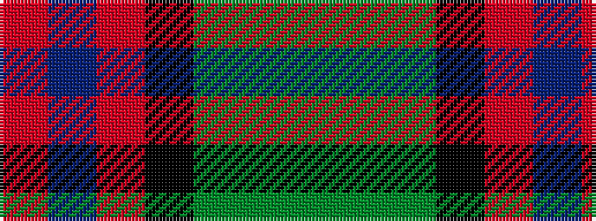

GGGKRBR

It is a 7 stripe tartan.

<figure class="pat-woven">

<figcaption>idealised sample</figcaption>
</figure>

## Colour Sequence



## Tartans with this colour sequence

| Tartans |
|---------------|
| [MacWilliam Htg](/variants/s7/dg2dy32dy12k10r1db16r2~x2/)|
||
