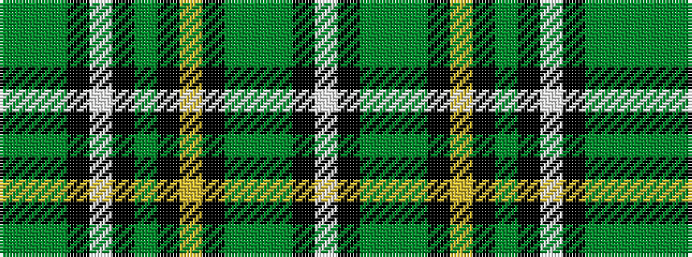

GGGKWKGKYKGGGKW

It is a 15 stripe tartan.

<figure class="pat-woven">

<figcaption>idealised sample</figcaption>
</figure>

## Colour Sequence



## Tartans with this colour sequence

| Tartans |
|---------------|
| [Ireland's National](/setts/s15/g5g22g13k5w4k7g5k2lo7k2g2g6g1k2w2~x2/)|
||
