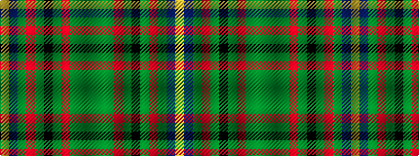

GGGRGKGRGBY

It is a 11 stripe tartan.

<figure class="pat-woven">

<figcaption>idealised sample</figcaption>
</figure>

## Colour Sequence



## Tartans with this colour sequence

| Tartans |
|---------------|
| [California Department of Forestry (Corporate)](/variants/s11/y30dg5g3r1g3k1g3r1g3db1lo1~x4/)|
||
