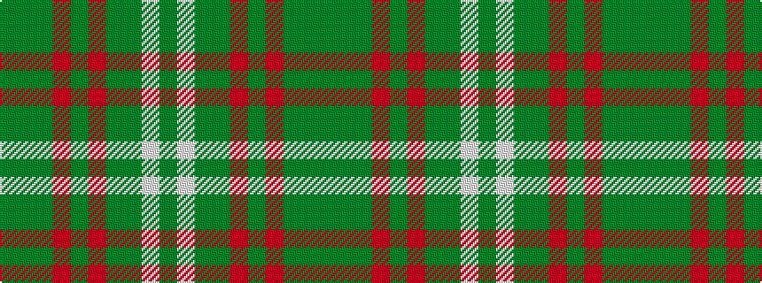

GGGRGRGGWG

It is a 10 stripe tartan.

<figure class="pat-woven">

<figcaption>idealised sample</figcaption>
</figure>

## Colour Sequence



## Tartans with this colour sequence

| Tartans |
|---------------|
| [Seton Htg (Clan)](/variants/s10/dy3g1dy15r2dy1r2dy1g7w1g2~x4/)|
||
| [Seton Hunting Family Tartan](/variants/s10/g6w1g12dy4r4dy2r4dy32g1dy2~x2/)|
||
