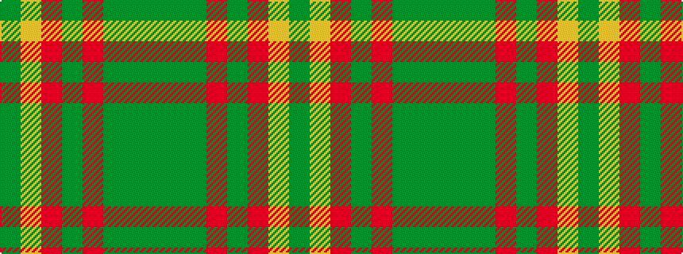

GGGRGRYG

It is a 8 stripe tartan.

<figure class="pat-woven">

<figcaption>idealised sample</figcaption>
</figure>

## Colour Sequence



## Tartans with this colour sequence

| Tartans |
|---------------|
| [Loch Rannoch #2](/variants/s8/dy24g2dy5o14g2o5lo17dy2~x2/)|
||
