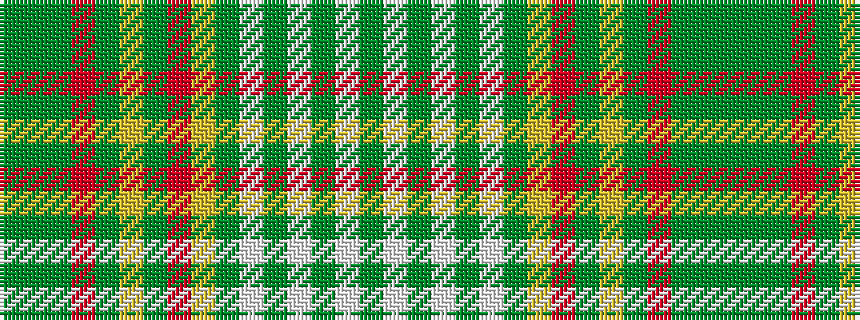

GGGRGYGRYGWGWGWG

It is a 16 stripe tartan.

<figure class="pat-woven">

<figcaption>idealised sample</figcaption>
</figure>

## Colour Sequence



## Tartans with this colour sequence

| Tartans |
|---------------|
| [Saint Joseph de Sorel (District)](/setts/s16/g8w1g3w1g3w1g8ly2o9g2lo5g2r12g8g3g3~x2/)|
||
