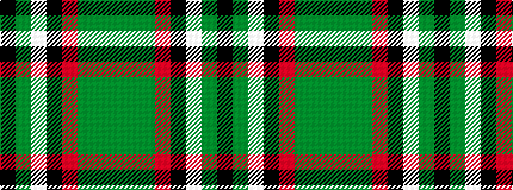

GGGRKWGK

It is a 8 stripe tartan.

<figure class="pat-woven">

<figcaption>idealised sample</figcaption>
</figure>

## Colour Sequence



## Tartans with this colour sequence

| Tartans |
|---------------|
| [Kintail Dress](/variants/s8/y3g32y36o12k2w68g3k2~x2/)|
||
