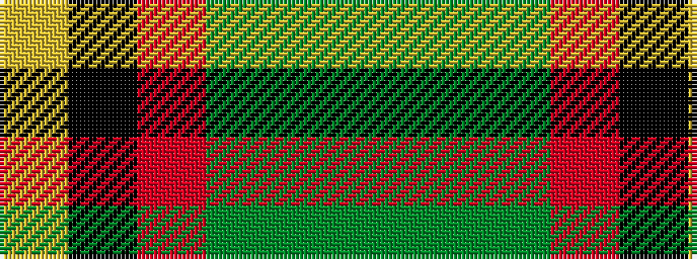

GGGRKY

It is a 6 stripe tartan.

<figure class="pat-woven">

<figcaption>idealised sample</figcaption>
</figure>

## Colour Sequence



## Tartans with this colour sequence

| Tartans |
|---------------|
| [Abadia Da Cova (Corporate)](/setts/s6/g30g1g3r30k1ly3~x2/)|
||
