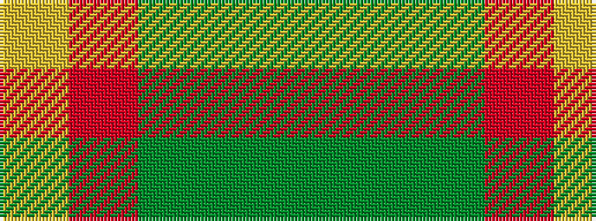

GGGRY

It is a 5 stripe tartan.

<figure class="pat-woven">

<figcaption>idealised sample</figcaption>
</figure>

## Colour Sequence



## Tartans with this colour sequence

| Tartans |
|---------------|
| [Ballantyne (Personal)](/variants/s5/y60g13y9r8ly4~x2/)|
||
