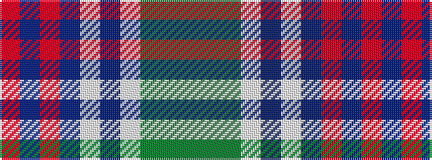

GGGWBWBRBR

It is a 10 stripe tartan.

<figure class="pat-woven">

<figcaption>idealised sample</figcaption>
</figure>

## Colour Sequence



## Tartans with this colour sequence

| Tartans |
|---------------|
| [Copar a'Beannichte Dress (Personal)](/setts/s10/gi6g20gi6w15dt5w2dt15o4dt10r2~x2/)|
||
