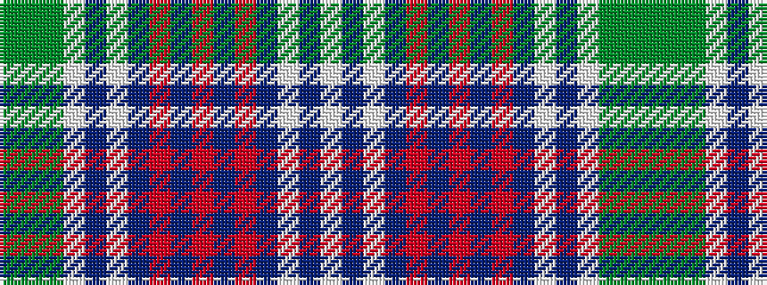

GGGWBWBRBRBRBWBW

It is a 16 stripe tartan.

<figure class="pat-woven">

<figcaption>idealised sample</figcaption>
</figure>

## Colour Sequence



## Tartans with this colour sequence

| Tartans |
|---------------|
| [Copar a'Beannichte Dress Family Tartan](/variants/s16/w15dt5w2dt15o4dt10r2dt10o4dt15w2dt5w15gi6g20gi6~x2/)|
||
