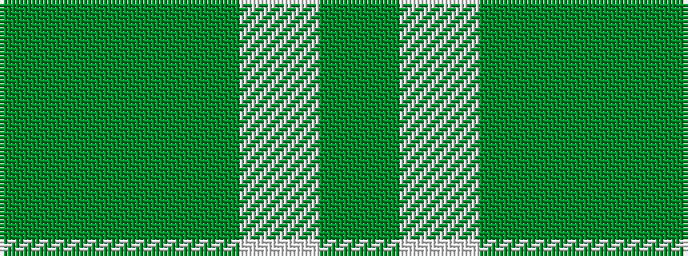

GGGWG

It is a 5 stripe tartan.

<figure class="pat-woven">

<figcaption>idealised sample</figcaption>
</figure>

## Colour Sequence



## Tartans with this colour sequence

| Tartans |
|---------------|
| [Castle Bay (Fashion)](/setts/s5/g40w2y5g5y15~x2/)|
||
