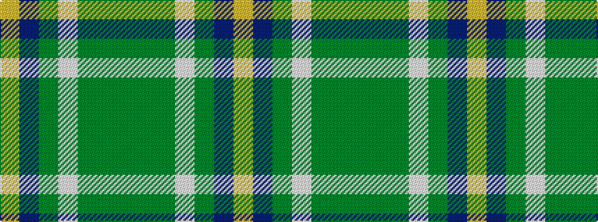

GGGWGBY

It is a 7 stripe tartan.

<figure class="pat-woven">

<figcaption>idealised sample</figcaption>
</figure>

## Colour Sequence



## Tartans with this colour sequence

| Tartans |
|---------------|
| [Wcwm 9275-1410](/variants/s7/g3dy32g4lb3g18dp18lo3~x2/)|
||
