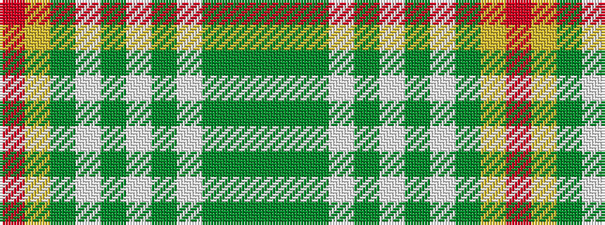

GGGWGWGWGYR

It is a 11 stripe tartan.

<figure class="pat-woven">

<figcaption>idealised sample</figcaption>
</figure>

## Colour Sequence



## Tartans with this colour sequence

| Tartans |
|---------------|
| [Original Tartan Ltd (Corporate)](/setts/s11/r2ly2g24lt10y6lt2y6lt1y71g2gi2~x2/)|
||
