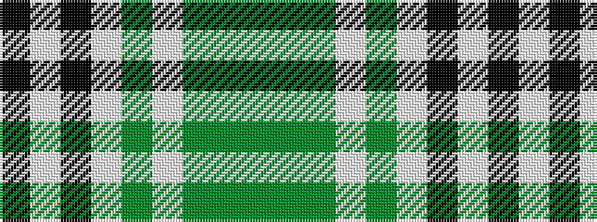

GGGWGWKWK

It is a 9 stripe tartan.

<figure class="pat-woven">

<figcaption>idealised sample</figcaption>
</figure>

## Colour Sequence



## Tartans with this colour sequence

| Tartans |
|---------------|
| [Burns Heritage Check](/setts/s9/k6w6k6w6g7w4dy3g2dy3~x2/)|
||
