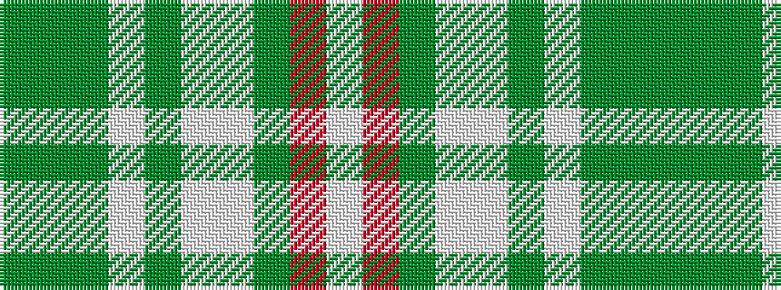

GGGWGWWGRW

It is a 10 stripe tartan.

<figure class="pat-woven">

<figcaption>idealised sample</figcaption>
</figure>

## Colour Sequence



## Tartans with this colour sequence

| Tartans |
|---------------|
| [Rikaco Eve](/variants/s10/g4y4g2w36y14w2lt4g7m5w3~x2/)|
||
