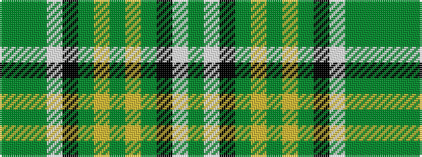

GGGWKGYGYGKWG

It is a 13 stripe tartan.

<figure class="pat-woven">

<figcaption>idealised sample</figcaption>
</figure>

## Colour Sequence



## Tartans with this colour sequence

| Tartans |
|---------------|
| [Duffy](/variants/s13/g25w1k23gi7ly2gi2ly2gi7k23w1g39gi4g14~x2/)|
||
| [Duffy Family Tartan](/variants/s13/gi25w1k23g7ly2g2ly2g7k23w1gi39g4gi14~x2/)|
||
