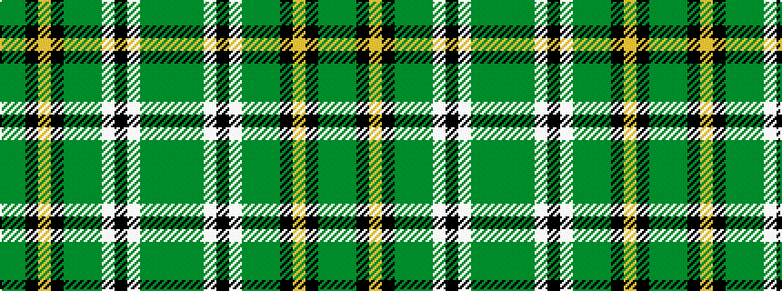

GGGWKWGGGKYKGG

It is a 14 stripe tartan.

<figure class="pat-woven">

<figcaption>idealised sample</figcaption>
</figure>

## Colour Sequence



## Tartans with this colour sequence

| Tartans |
|---------------|
| [Wexford, County](/variants/s14/g11dg6g6w1k2w1g6dg6g36k1ly3k1g5dg5~x2/)|
||
