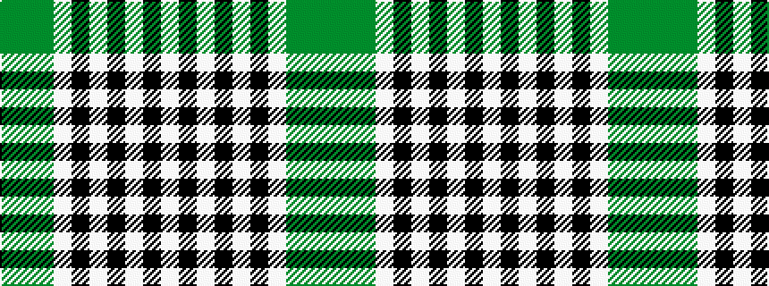

GGGWKWKWKW

It is a 10 stripe tartan.

<figure class="pat-woven">

<figcaption>idealised sample</figcaption>
</figure>

## Colour Sequence



## Tartans with this colour sequence

| Tartans |
|---------------|
| [Burns Check](/variants/s10/w2k2w2k2w2k2w1y1g1y1~x8/)|
||
| [Burns Check (District)](/variants/s10/w6k6w6k6w6k6w4y3g2y2~x3/)|
||
| [Burns Check Trade Tartan](/variants/s10/w2k2w2k2w2k2w1dy1g1dy1~x2/)|
||
