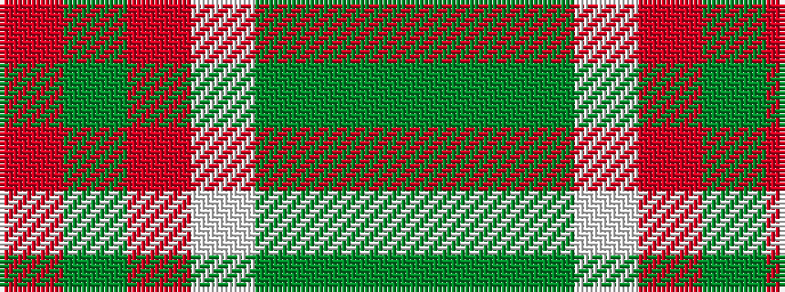

GGGWRGR

It is a 7 stripe tartan.

<figure class="pat-woven">

<figcaption>idealised sample</figcaption>
</figure>

## Colour Sequence



## Tartans with this colour sequence

| Tartans |
|---------------|
| [Bannockbane, Green](/variants/s7/dg8gi6dg48w31o42g6o8/)|
||
