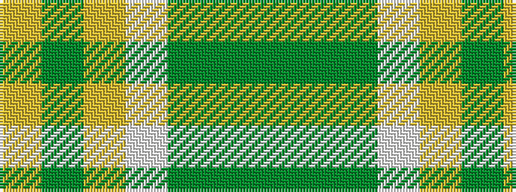

GGGWYGY

It is a 7 stripe tartan.

<figure class="pat-woven">

<figcaption>idealised sample</figcaption>
</figure>

## Colour Sequence



## Tartans with this colour sequence

| Tartans |
|---------------|
| [Bannockbane Dark Green](/setts/s7/dg4g3dg24w15lo21gi3lo4~x2/)|
||
