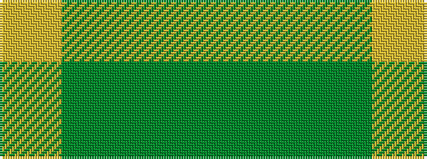

GGGY

It is a 4 stripe tartan.

<figure class="pat-woven">

<figcaption>idealised sample</figcaption>
</figure>

## Colour Sequence



## Tartans with this colour sequence

| Tartans |
|---------------|
| [McGuigan, Julia (St Monans, Fife) (Personal)](/setts/s4/y9yi52dy15ly4~x2/)|
||
| [Spring Morning (Fashion)](/setts/s4/g1y9g9lo1~x4/)|
||
