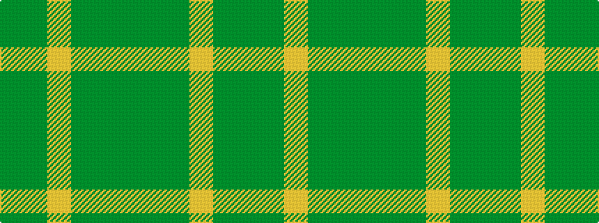

GGGYGG

It is a 6 stripe tartan.

<figure class="pat-woven">

<figcaption>idealised sample</figcaption>
</figure>

## Colour Sequence



## Tartans with this colour sequence

| Tartans |
|---------------|
| [Spring Morning](/variants/s6/y9g9lo1g9y9g1~x4/)|
||
