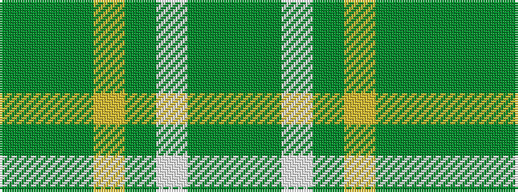

GGGYGWGG

It is a 8 stripe tartan.

<figure class="pat-woven">

<figcaption>idealised sample</figcaption>
</figure>

## Colour Sequence



## Tartans with this colour sequence

| Tartans |
|---------------|
| [Aviemore Check](/setts/s8/g2dy10g11ly4dy1w18g2dy1~x2/)|
||
