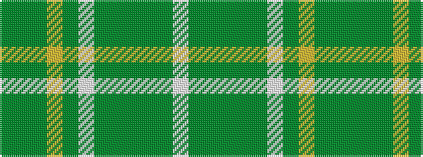

GGGYGWGGGGGW

It is a 12 stripe tartan.

<figure class="pat-woven">

<figcaption>idealised sample</figcaption>
</figure>

## Colour Sequence



## Tartans with this colour sequence

| Tartans |
|---------------|
| [Kelly Dress](/variants/s12/y68dy4g9lr2g3w3g3dy12y6g3y3w3~x2/)|
||
