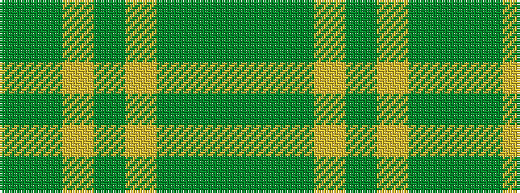

GGGYGYGG

It is a 8 stripe tartan.

<figure class="pat-woven">

<figcaption>idealised sample</figcaption>
</figure>

## Colour Sequence



## Tartans with this colour sequence

| Tartans |
|---------------|
| [Semper](/setts/s8/gi16dg1lg4dg41lg1dg6g2dg2~x2/)|
||
