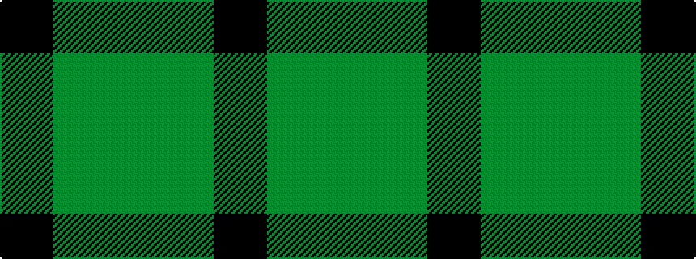

GGK

It is a [3 stripe pattern](/stripes/stripes3/) — every 3-stripe pattern is gathered there.

<figure class="pat-woven">

<figcaption>idealised sample</figcaption>
</figure>

## Colour Sequence



## Tartans with this colour sequence

This pattern is a design lineage: every tartan below shares one colour order, whatever its owner —
near-identical designs are grouped, the largest lineage first (#112: the pattern is a tartan's
second parent, beside its family or clan).

<table class="sett-table">
<tbody>
<tr><td><a href="/tartans/w/wi/wilson-s-no-197/">Wilson's No.197</a></td></tr>
<tr><td class="sett-swatch"></td></tr>
<tr><td><a href="/tartans/w/wi/wilson-s-no-2-53-or-mull/">Wilson's, No 2/53 or Mull</a> <small class="dt">ΔTartan 0.40</small></td></tr>
<tr><td class="sett-swatch"></td></tr>
<tr><td><a href="/tartans/z/zw/zwijnenberg-frans/">Zwijnenberg, Frans</a> <small class="dt">ΔTartan 0.94</small></td></tr>
<tr><td class="sett-swatch"></td></tr>
</tbody>
</table>

