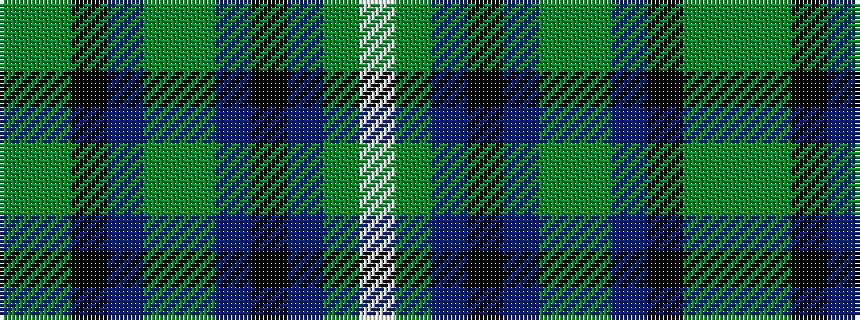

GGKBGGBKBGW

It is a 11 stripe tartan.

<figure class="pat-woven">

<figcaption>idealised sample</figcaption>
</figure>

## Colour Sequence



## Tartans with this colour sequence

| Tartans |
|---------------|
| [MacLean, Kenneth, baron of Denboig (Personal)](/setts/s11/dg19g5k2t3dg5g3t5k2db3g5w2~x2/)|
||
