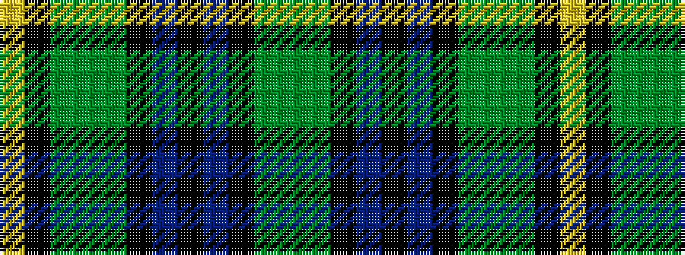

GGKBKBKGGGKY

It is a 12 stripe tartan.

<figure class="pat-woven">

<figcaption>idealised sample</figcaption>
</figure>

## Colour Sequence



## Tartans with this colour sequence

| Tartans |
|---------------|
| [Paterson (Dalgleish Version)](/setts/s12/ly3k1g5y2g5k12db15k2db15k12g12y2~x2/)|
||
