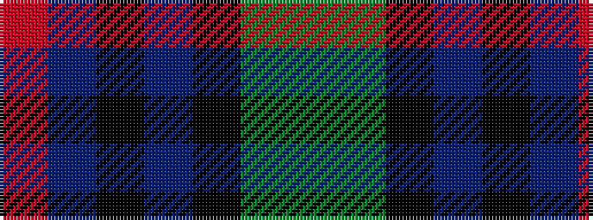

GGKBKBR

It is a 7 stripe tartan.

<figure class="pat-woven">

<figcaption>idealised sample</figcaption>
</figure>

## Colour Sequence



## Tartans with this colour sequence

| Tartans |
|---------------|
| [Bennett, John Paul (Personal)](/setts/s7/r4n38k4n6k41dg62y4/)|
||
| [Heritage (Corporate)](/setts/s7/r5db8k5db24k24y24y5~x2/)|
||
