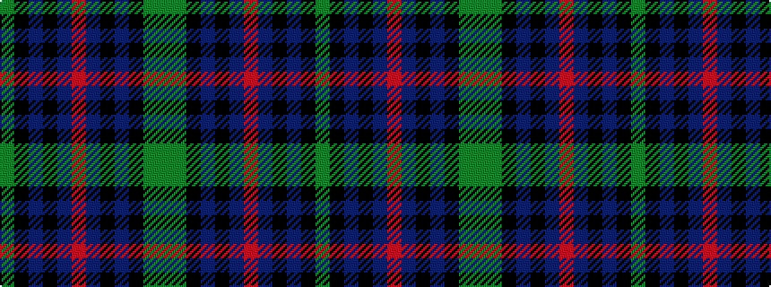

GGKBKBRBKBKG

It is a 12 stripe tartan.

<figure class="pat-woven">

<figcaption>idealised sample</figcaption>
</figure>

## Colour Sequence



## Tartans with this colour sequence

| Tartans |
|---------------|
| [Heritage](/setts/s12/yi24k24db24k5db8r5db8k5db24k24yi24y5~x2/)|
||
