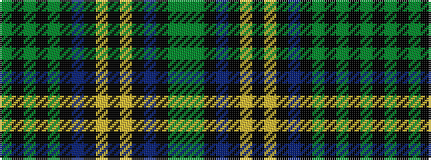

GGKBKYKYKBKGKGKG

It is a 16 stripe tartan.

<figure class="pat-woven">

<figcaption>idealised sample</figcaption>
</figure>

## Colour Sequence



## Tartans with this colour sequence

| Tartans |
|---------------|
| [Hope Vere Family Tartan](/variants/s16/g19k1gi3k1g3k9db20k1ly1k7ly1k1db21k12g2gi1~x2/)|
||
| [Hope-Vere/Weir (Modern)](/variants/s16/g19k1dg3k1g3k9db20k1ly1k7ly1k1db21k12g2dg1~x2/)|
||
