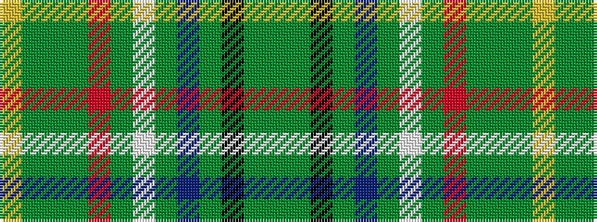

GGKGBGWGRGGGY

It is a 13 stripe tartan.

<figure class="pat-woven">

<figcaption>idealised sample</figcaption>
</figure>

## Colour Sequence



## Tartans with this colour sequence

| Tartans |
|---------------|
| [Irish American](/setts/s13/g50dg3k3dg9db7dg2w4dg2r5dg2g8dg5ly4~x2/)|
||
