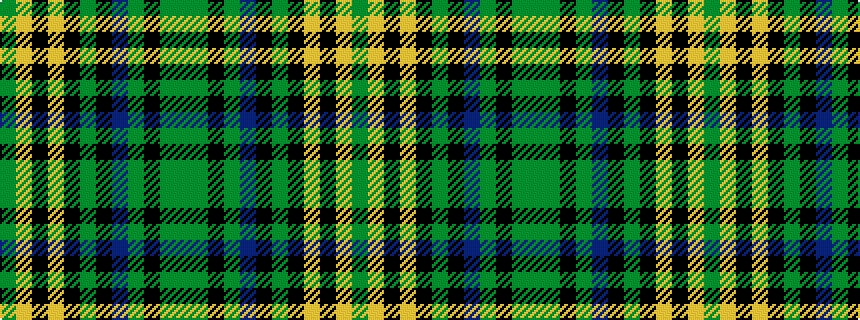

GGKGBKGKYKYG

It is a 12 stripe tartan.

<figure class="pat-woven">

<figcaption>idealised sample</figcaption>
</figure>

## Colour Sequence



## Tartans with this colour sequence

| Tartans |
|---------------|
| [Bottle Green (Fashion)](/setts/s12/g30loi4k6lo2k2g4k2db5y4k2y3g2~x2/)|
||
