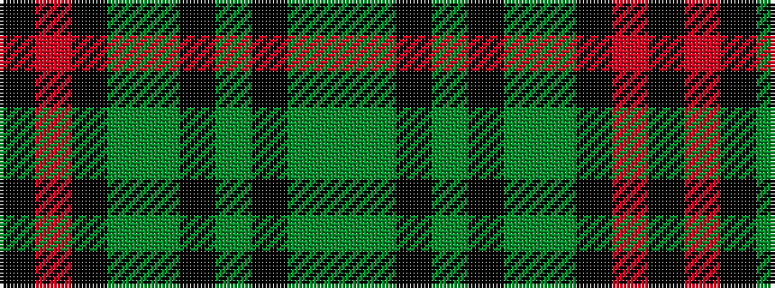

GGKGKGGKRK

It is a 10 stripe tartan.

<figure class="pat-woven">

<figcaption>idealised sample</figcaption>
</figure>

## Colour Sequence



## Tartans with this colour sequence

| Tartans |
|---------------|
| [Dinwiddie](/setts/s10/y7y2k2y41k12g22y6k2r4k2~x2/)|
||
