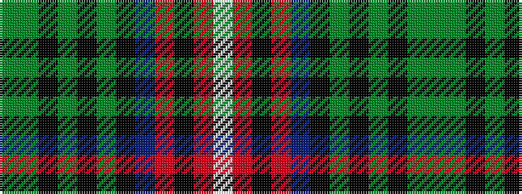

GGKGKGKBRKRW

It is a 12 stripe tartan.

<figure class="pat-woven">

<figcaption>idealised sample</figcaption>
</figure>

## Colour Sequence



## Tartans with this colour sequence

| Tartans |
|---------------|
| [Chattahoochee](/setts/s12/y3dg15k3dg3k3dg4k8db8r11k3r3w3~x2/)|
||
